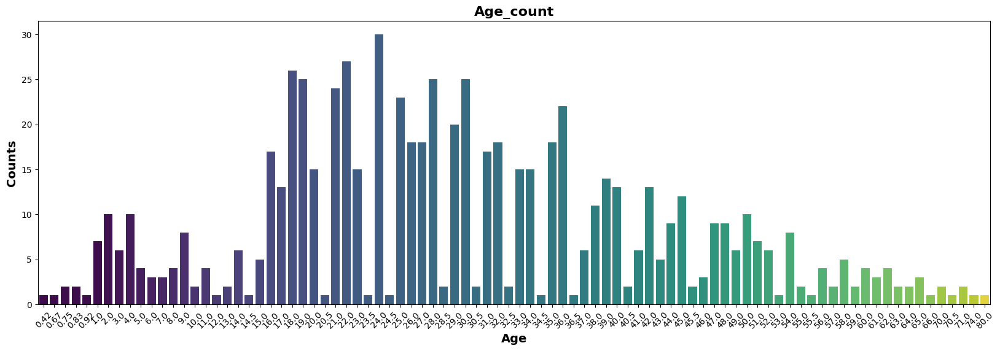
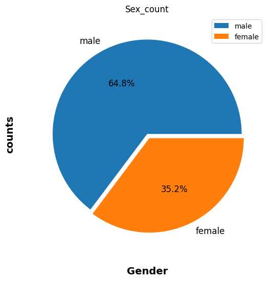
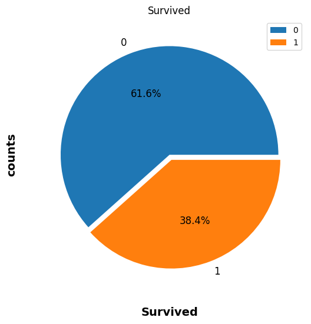
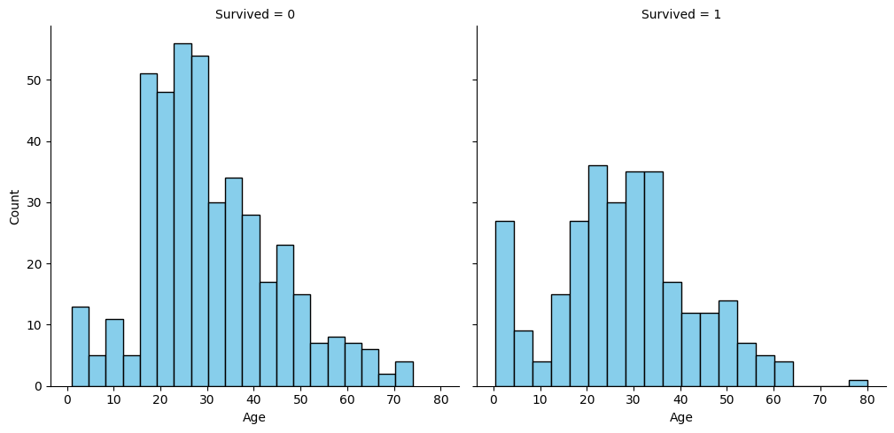
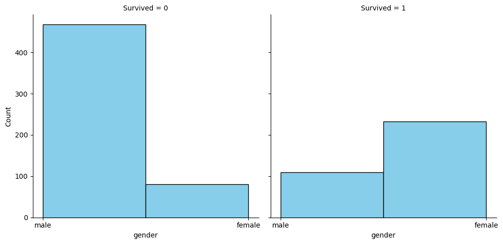
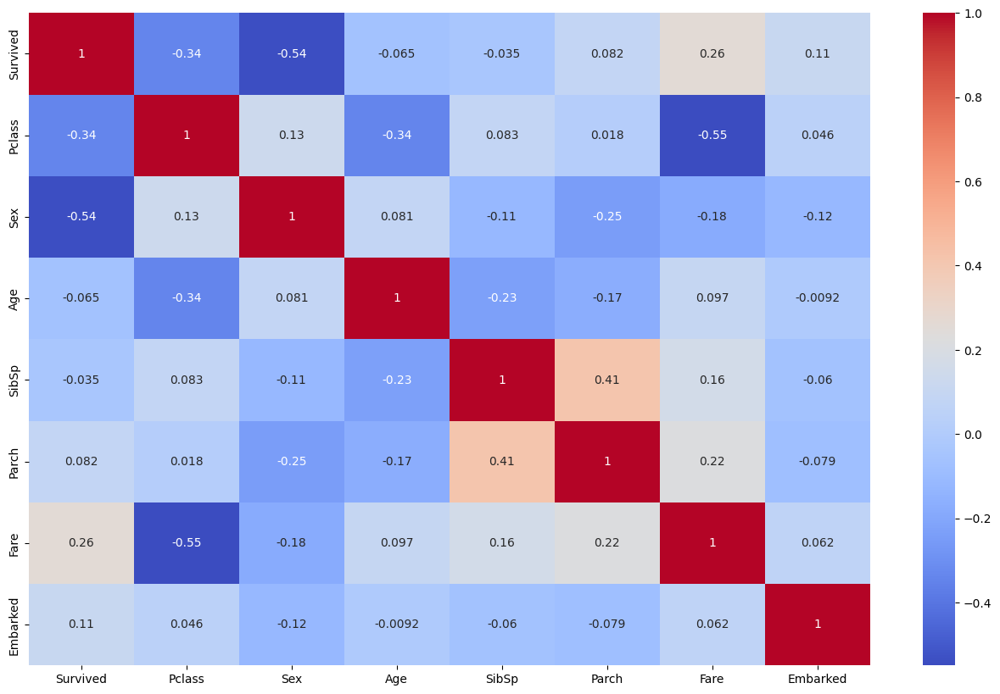
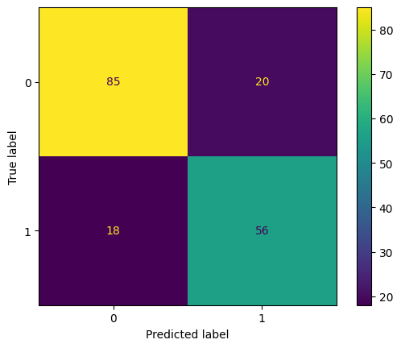

# Titanic Survived


## Sobre o conjunto de dados

#### Descrição: 
O naufrágio do Titanic é um dos naufrágios mais infames da história.

Em 15 de abril de 1912, durante sua viagem inaugural, o amplamente considerado "inafundável" RMS Titanic afundou após colidir com um iceberg. Infelizmente, não havia botes salva-vidas suficientes para todos a bordo, resultando na morte de 1502 dos 2224 passageiros e tripulantes.

Embora houvesse algum elemento de sorte envolvido na sobrevivência, parece que alguns grupos de pessoas tinham mais probabilidade de sobreviver do que outros.

Neste desafio, pedimos que você construa um modelo preditivo que responda à pergunta: “que tipos de pessoas tinham mais probabilidade de sobreviver?” usando dados de passageiros (ou seja, nome, idade, sexo, classe socioeconômica, etc.).

#### Objetivo:
- Entenda o conjunto de dados e limpe-o (se necessário).
- Crie um modelo de classificação forte para prever se o passageiro sobrevive ou não.
- Ajuste também os hiperparâmetros e compare as métricas de avaliação de vários algoritmos de classificação.

#### Conjunto de dados:  Titanic-Dataset.csv

| PassageiroId | Sobreviveu | Pclass | Nome                                                       | Sexo    | Idade | SibSp | Seca | Bilhete             | Tarifa   | Cabine | Embarcado |
|--------------|------------|--------|------------------------------------------------------------|---------|-------|-------|------|---------------------|----------|--------|-----------|
| 1            | 0          | 3      | Braund, Sr. Owen Harris                                    | macho   | 22    | 1     | 0    | A/5 21171           | 7.25     | S      |           |
| 2            | 1          | 1      | Cumings, Sra. John Bradley (Florence Briggs Thayer)      | fêmea   | 38    | 1     | 0    | PC 17599            | 71.2833  | C85    | C         |
| 3            | 1          | 3      | Heikkinen, Srta. Laina                                    | fêmea   | 26    | 0     | 0    | PEDRAS/O2. 3101282  | 7.925    | S      |           |
| 4            | 1          | 1      | Futrelle, Sra. Jacques Heath (Lily May Peel)             | fêmea   | 35    | 1     | 0    | 113803              | 53.1     | C123   | S         |
| 5            | 0          | 3      | Allen, Sr. William Henry                                   | macho   | 35    | 0     | 0    | 373450              | 8.05     | S      |           |
| 6            | 0          | 3      | Moran, Sr. James                                          | macho   | 0     | 0     | 330877| 8.4583              | Pq      |           |
| 7            | 0          | 1      | McCarthy, Sr. Timothy J                                   | macho   | 54    | 0     | 0    | 17463               | 51.8625  | E46    | S         |
| 8            | 0          | 3      | Palsson, Mestre. Gosta Leonard                            | macho   | 2     | 3     | 1    | 349909              | 21.075   | S      |           |
| 9            | 1          | 3      | Johnson, Sra.                                            | fêmea   | 27    | 0     | 2    | 347742              | 11.1333  | S      |           |
| 10           | 1          | 2      | Nasser, Sra. Nicholas (Adele Achem)                      | fêmea   | 14    | 1     | 0    | 237736              | 30.0708  | C      |           |
| 11           | 1          | 3      | Sandstrom, Srta. Marguerite Rut                          | fêmea   | 4     | 1     | 1    | PP 9549             | 16.7     | G6     | S         |
| 12           | 1          | 1      | Bonnell, Srta. Elizabeth                                   | fêmea   | 58    | 0     | 0    | 113783              | 26.55    | C103   | S         |
| 13           | 0          | 3      | Saundercock, Sr. William Henry                            | macho   | 20    | 0     | 0    | A/5.2151            | 8.05     | S      |           |
| 14           | 0          | 3      | Andersson, Sr. Anders Johan                               | macho   | 39    | 1     | 5    | 347082              | 31.275   | S      |           |
| 15           | 0          | 3      | Vestrom, Srta. Hulda Amanda Adolfina                     | fêmea   | 14    | 0     | 0    | 350406              | 7.8542   | S      |           |
| 16           | 1          | 2      | Hewlett, Sra. (Mary D Kingcome)                          | fêmea   | 55    | 0     | 0    | 248706              | 16       | S      |           |
| 17           | 0          | 3      | Arroz, Mestre. Eugene                                     | macho   | 2     | 4     | 1    | 382652              | 29.125   | Pq     |           |
| 18           | 1          | 2      | Williams, Sr. Charles Eugene                              | macho   | 0     | 0     | 244373| 13                 | S         |
| 19           | 0          | 3      | Vander Planke, Sra. Julius (Emelia Maria Vandemoortele) | fêmea   | 31    | 1     | 0    | 345763              | 18       | S      |           |
| 20           | 1          | 3      | Masselmani, Sra. Fátima                                   | fêmea   | 0     | 0     | 2649  | 7.225              | C      |           |
| ...          | ...        | ...    | ...                                                        | ...     | ...   | ...   | ...  | ...                 | ...      | ...    | ...       |

#### Descrição colunas
- **PassengerId:**  Identificador exclusivo atribuído a cada passageiro.
- **Survived:** Indica se um passageiro sobreviveu (1) ou morreu (0).
- **Pclass:** Representa a classe do passageiro, que pode ser um valor numérico ou categórico que indica a classe da viagem (por exemplo, primeira, segunda ou terceira classe).
- **Name:** Nome do passageiro.
- **Sex:** Representa o sexo do passageiro, normalmente categorizado como masculino ou feminino.
- **Age:** A idade do passageiro, muitas vezes representada como um valor numérico.
- **SibSp:** Indica o número de irmãos ou cônjuges que viajam com o passageiro.
- **Parch:** Representa o número de pais ou filhos que viajam com o passageiro.
- **Ticket:** O número do bilhete associado ao bilhete do passageiro.
- **Fare:** A quantidade de dinheiro gasto na passagem.
- **Cabin:** Representa a categoria ou número de cabine atribuído ao passageiro, se disponível.
- **Embarked:** Indica o porto de onde o passageiro embarcou, normalmente representado por um código de um único caractere (por exemplo, C para Cherbourg, Q para Queenstown, S para Southampton).


## Visualização dos dados

#### Visualizar a contagem de idades
```
    plt.figure(figsize=(20, 6))
    sns.barplot(x=age.index, y=age.values, hue=age.index, dodge=False, palette='viridis', legend=False)
    plt.title('Age_count', fontsize=16, weight='bold')
    plt.xlabel('Age', fontsize=14, weight='bold')
    plt.ylabel('Counts', fontsize=14, weight='bold')
    plt.xticks(rotation=45)
    plt.show()
```




#### Visualizar a contagem de Generos
```
    plt.figure(figsize = (20, 6))
    explode = (0,0.05)
    sex.plot(kind = 'pie', fontsize = 12, explode = explode, autopct = '%.1f%%')
    plt.title('Sex_count')
    plt.xlabel('Gender', weight = "bold", color = "#000000", fontsize = 14, labelpad = 20)
    plt.ylabel('counts', weight = "bold", color = "#000000", fontsize = 14, labelpad = 20)
    plt.legend(labels = sex.index, loc = "best")
    plt.show()
```


#### Visualizar a contagem de sobreviventes
```
    plt.figure(figsize = (20, 6))
    explode = (0,0.05)
    Survived_counts.plot(kind = 'pie', fontsize = 12, explode = explode, autopct = '%.1f%%')
    plt.title('Survived')
    plt.xlabel('Survived', weight = "bold", color = "#000000", fontsize = 14, labelpad = 20)
    plt.ylabel('counts', weight = "bold", color = "#000000", fontsize = 14, labelpad = 20)
    plt.legend(labels = Survived_counts.index, loc = "best")
    plt.show()
```



#### Visualizar a contagem de sobreviventes por idade
```
    age = sns.FacetGrid(titanic, col='Survived', height=5, aspect=1.0)
    age.map(plt.hist, 'Age', bins=20, color='skyblue', edgecolor='black')
    age.set_axis_labels('Age', 'Count')
    age.set_titles('Survived = {col_name}')
    plt.show()
```


#### Visualizar a contagem de sobreviventes por genero
```
    gender = sns.FacetGrid(titanic, col='Survived', height=5, aspect=1.0)
    gender.map(plt.hist, 'Sex', bins=2, color='skyblue', edgecolor='black')
    gender.set_axis_labels('gender', 'Count')
    gender.set_titles('Survived = {col_name}')
    plt.show()
```



## Pré-processamento dos Dados

#### Preenchendo valores faltantes de 'Age' com a mediana
```
    titanic['Age'] = titanic['Age'].fillna(titanic['Age'].median())
```

#### Preenchendo valores faltantes de 'Embarked' com a moda (valor mais frequente)
```
    titanic['Embarked'] = titanic['Embarked'].fillna(titanic['Embarked'].mode()[0])
```

#### Retirando colunas que não vai usar
```
    # A coluna 'Cabin' possui um grande número de valores ausentes

    titanic=titanic.drop(columns=['PassengerId', 'Name', 'Cabin', 'Ticket'], axis=1)
```

#### Convertendo a variável categórica 'Sex'
```
    titanic['Sex']=titanic['Sex'].replace({'male':1,'female':0})
```

#### Convertendo a variável categórica 'Embarked'
```
    titanic['Embarked']=titanic['Embarked'].replace({'S':1,'C':2,'Q':3})
```

#### Calculando a matriz de correlação
```
    corr_matrix = titanic.corr()
    display(corr_matrix)
```
|          | Survived | Pclass   |   Sex   |   Age   | SibSp   | Parch   |   Fare   | Embarked |
|----------|----------|----------|---------|---------|---------|---------|----------|----------|
| Survived |  1.000000| -0.338481| -0.543351| -0.064910| -0.035322| 0.081629| 0.257307 | 0.106811 |
| Pclass   | -0.338481|  1.000000|  0.131900| -0.339898| 0.083081| 0.018443| -0.549500| 0.045702 |
| Sex      | -0.543351|  0.131900|  1.000000|  0.081163| -0.114631| -0.245489| -0.182333| -0.116569|
| Age      | -0.064910| -0.339898|  0.081163|  1.000000| -0.233296| -0.172482| 0.096688 | -0.009165|
| SibSp    | -0.035322|  0.083081| -0.114631| -0.233296|  1.000000| 0.414838| 0.159651 | -0.059961|
| Parch    |  0.081629|  0.018443| -0.245489| -0.172482|  0.414838|  1.000000| 0.216225 | -0.078665|
| Fare     |  0.257307| -0.549500| -0.182333|  0.096688| 0.159651 | 0.216225 |  1.000000| 0.062142 |
| Embarked |  0.106811|  0.045702| -0.116569| -0.009165| -0.059961| -0.078665| 0.062142 | 1.000000 |


#### Criando um mapa de calor
```
    plt.figure(figsize=(16, 10))
    sns.heatmap(corr_matrix, annot=True, cmap='coolwarm')
    plt.show()
```



#### definir recursos e alvo
```
    x = titanic.drop(columns=['Survived'])
    y = titanic['Survived']
```

#### Escalonamento, Transformação do alvo e Divisão em treino e teste
```
    scaler=MinMaxScaler()
    x=scaler.fit_transform(x)

    y=y.values.reshape(-1,1)

    X_train,X_test,y_train,y_test=train_test_split(x,y,test_size=0.2,shuffle=True,random_state=42)
```

## Modelo Arvore de Decisão

Opção de uso:
- Mais conhecimentos sobre o modelo
- As árvores de decisão são fáceis de entender e interpretar.
- Árvores de decisão podem lidar facilmente com variáveis categóricas e numéricas sem necessidade de codificação prévia

#### Criando o modelo de árvore de decisão com random_state definido
```
    model = DecisionTreeClassifier(random_state=42)

    # Treinando o modelo
    model.fit(X_train, y_train)
    
    # acurácia do modelo em relação ao conjunto de dados de treinamento (X_train e y_train)
    model.score(X_train,y_train)
```
0.9789325842696629

#### Fazendo previsões
```
    y_pred=model.predict(X_test)
    print(accuracy_score(y_test,y_pred))
```
0.7877094972067039 

#### Matriz de Confusão
```
    ConfusionMatrixDisplay.from_predictions(y_test, y_pred)
    print(confusion_matrix(y_test, y_pred))
```


**True Negatives (TN): 85** - O modelo previu corretamente que 85 passageiros não sobreviveriam.

**False Positives (FP): 20** - O modelo previu incorretamente que 20 passageiros não sobreviveriam, quando na verdade sobreviveram.

**False Negatives (FN): 18** - O modelo previu incorretamente que 18 passageiros sobreviveriam, quando na verdade não sobreviveram.

**True Positives (TP): 56** - O modelo previu corretamente que 56 passageiros sobreviveriam.

#### Relatório de Classificação
```
    print(classification_report(y_test, y_pred))
```
|           | precision | recall | f1-score | support |
|-----------|-----------|--------|----------|---------|
|     0     |    0.83   |  0.81  |   0.82   |   105   |
|     1     |    0.74   |  0.76  |   0.75   |    74   |
| accuracy   |           |        |   0.79   |   179   |
| macro avg  |    0.78   |  0.78  |   0.78   |   179   |
| weighted avg|   0.79   |  0.79  |   0.79   |   179   |


**Precisão (Precision):** A proporção de verdadeiros positivos sobre o total de positivos previstos. Uma precisão de 0.83 para a classe 0 indica que 83% das previsões de não sobrevivência estavam corretas.

**Recuperação (Recall):** A proporção de verdadeiros positivos sobre o total de positivos reais. Uma recuperação de 0.76 para a classe 1 indica que o modelo identificou 76% dos sobreviventes corretamente.

**F1-Score:** A média harmônica de precisão e recuperação. É uma boa métrica quando há um desbalanceamento entre classes.

**Acurácia:** A proporção de previsões corretas em relação ao total de previsões. Neste caso, a acurácia foi de 0.79, ou seja, 79% das previsões estavam corretas.

